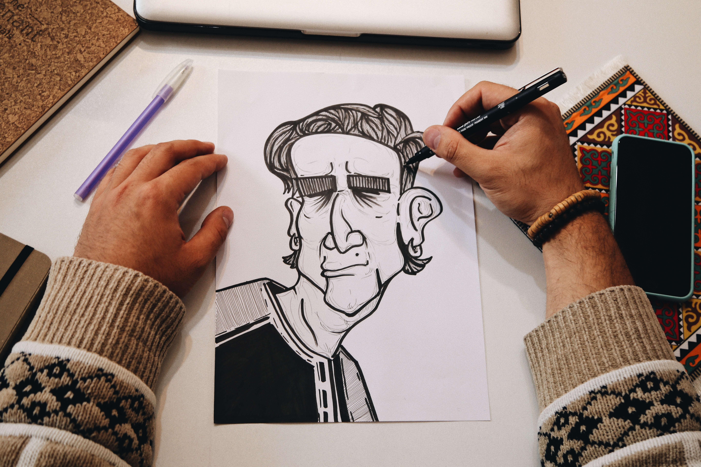

# Portfolio-AndikaDirmaYuda
You can my Portfolio in "https://adrmyd.000webhostapp.com/"

<!DOCTYPE html>
<html lang="en">
  <head>
    <meta charset="UTF-8" />
    <meta name="viewport" content="width=device-width, initial-scale=1.0" />
    <title>Portfolio | Adrmyd</title>
    <!-- boostrap css -->
    <link rel="stylesheet" href="vendors/boostrap/css/bootstrap.min.css" />
    <!-- boxicons -->
    <link rel="stylesheet" href="vendors/boxicons/css/boxicons.min.css" />
    <!-- swiperjs -->
    <link rel="stylesheet"href="https://cdn.jsdelivr.net/npm/swiper@10/swiper-bundle.min.css"/>
    <!-- Feather  -->
    
    <!-- css -->
    <link rel="stylesheet" href="styles/style.css" />
    
  </head>
  <body>
    <!-- NAVBAR -->
    <nav class="navbar navbar-expand-md">
      

        <a class="navbar-brand fw-bold ms-5 text-white" href="#">@adrmyd</a>
        
          <button class="navbar-toggler" type="button" data-bs-toggle="collapse" data-bs-target="#navbarSupportedContent" aria-label="Toggle navigation">
          
        </button>
        

          <ul class="navbar-nav ms-auto mb-2 mb-lg-0">
            <li class="nav-item">
              <a class="nav-link text-white" aria-current="page" href="#">Home</a>
            </li>
            <li class="nav-item">
              <a class="nav-link text-white" href="#portfolio">Portofolio</a>
            </li>
            </li>
            <li class="nav-item">
              <a class="nav-link text-white" href="#skills">Skills</a>
            </li>
            </li>
            <li class="nav-item">
              <a class="nav-link text-white" href="#Timeline">Timeline</a>
            </li>
            </li>
            <li class="nav-item">
              <a class="nav-link text-white" href="#News">News</a>
            </li>
            </li>
            <li class="nav-item">
              <a class="nav-link text-white " href="#Contact">Contact</a>
            </li>
          </ul>
          
        

      

    </nav>
  <!-- HEADER -->
  <section class="header-section " id="header">
    

      

        

          
Hai,

          <h1 class="header-title  fw-semibold text-white"> I'am  Andika Dirma Yuda</h1>
           
          <a href="#" class="header-skill d-inline-flex align-items-center gap-2">Web Development<i class=" fs-4"></i></a>  
          <a href="#" class="header-skill d-inline-flex align-items-center gap-2">Graphic Designer<i class="fs-4"></i></a>  
          <a href="#" class="header-skill d-inline-flex align-items-center gap-2">Adventurer<i class="fs-4"></i></a>

          

            

              <h2 class="header-skill fw-bold"></h2>
              

            

          

          

            

              <h2 class="header-skill fw-bold"></h2>
              
DON'T FOLLOW ME, BECAUSE I'M ALSO LOST

            

          

        

        

          
        

      

    

  </section>

  <!-- PORTFOLIO -->
      <section class="portfolio-section" id="portfolio">
        

          

    
          
Portfolio

          <h2 class="section-title text-white mb-5">My Works</h2>

      <!-- swiper -->
      

        

          

            

              

                
                <h6 class="fw-semibold">Study</h6>
                
              

             

            

          

            

              

                
                <h6 class="fw-semibold">Make Your Schedule</h6>
                
              

             

            

          

            

              

                
                <h6 class="fw-semibold">Drawing</h6>
                
              

             

            

          

            

              

                
                <h6 class="fw-semibold">Adventurer</h6>
                
              

             

            

          
           
        

      

      
      

        <button class="btn btn-light d-flex align-items-center justify-content-center btn-next">
          <i class="bx bx-left-arrow-alt fs-5"></i>
        </button>
        <button class="btn btn-light d-flex align-items-center justify-content-center btn-prev">
          <i class="bx bx-right-arrow-alt fs-5"></i>
        </button>
      

  </section>

  <!-- SKILLS -->
  <section class="skills-section" id="skills">
    

      

        

          
Skills

          <h2 class="section-title text-white mb-5">My Skills</h2>

          

            

              
Nothing

              
0%

            

            

                
            

          

            

              
Nothing

              
0%

            

            

                
            

          

            

              
Nothing

              
0%

            

            

                
            

          

        

      

      

      

          
    

      

    

  </section>

  <!-- TIMELINE -->
  <section class="Timeline-section " id="Timeline">
    

      
Timeline

      <h2 class="section-title text-white mb-5">Roadmap</h2>
      

        
Sunday

        
Makan

        
Home

      

      

        
Monday

        
Tidur

        
Home

      

      

        
Thusday

        
Makan

        
Home

      

      

        
Everyday

        
Tidur

        
Home

      

    

  </section>

  <!-- NEWS -->
  <section class="News-section" id="News">
    

      
News

      <h2 class="section-title text-white mb-5">Latest News</h2>

      <!-- swiper -->
      

        

          

            

              

                
                <h6 class="fw-semibold">Makan</h6>
                
Everyday

                <a href="#" class="text-dark">Detail News</a>
              

             

            

          

            

              

                
                <h6 class="fw-semibold">Tidur</h6>
                
Everyday

                <a href="#" class="text-dark">Detail News</a>
              

             

            

          

            

              

                
                <h6 class="fw-semibold">Makan</h6>
                
Everyday

                <a href="#" class="text-dark">Detail News</a>
              

             

            

          

            

              

                
                <h6 class="fw-semibold">Tidur</h6>
                
Everyday

                <a href="#" class="text-dark">Detail News</a>
              

             

            

          

            

              

                
                <h6 class="fw-semibold">Makan</h6>
                
Everyday

                <a href="#" class="text-dark">Detail News</a>
              

             

            

          

            

              

                
                <h6 class="fw-semibold">Tidur</h6>
                
Everyday

                <a href="#" class="text-dark">Detail News</a>
              

             

            

        

      

      
      

        <button class="btn btn-light d-flex align-items-center justify-content-center btn-next">
          <i class="bx bx-left-arrow-alt fs-5"></i>
        </button>
        <button class="btn btn-light d-flex align-items-center justify-content-center btn-prev">
          <i class="bx bx-right-arrow-alt fs-5"></i>
        </button>
      

  </section>

  <!-- CONTACT -->
  <section class="Contact-section" id="Contact">
    

      

      
Contact

      <h2 class="section-title text-white mb-5">Get in touch</h2>
      

        
      

      

        <i class="bx bx-map-pin text-white fs-5"></i>
      
Indonesia

      

      

        <i class="bx bx-phone-call text-white fs-5"></i>
        
+62 XXX-XXXX-XXXX

      

      

        <i class="bx bx-envelope text-white fs-5"></i>
        
aaaaaa21@gmail.com

      

    
        

          <form action="#">
            <input 
            type="text" 
            name="name" 
            id="name"
            placeholder="name"
            class="form-control rounded-0 mb-2">
            <input 
            type="text" 
            name="email" 
            id="email"
            placeholder="email"
            class="form-control rounded-0 mb-2">
            <textarea 
            name="body" 
            id="body" 
            placeholder="Message" 
            cols="30" 
            rows="3" 
            class="form-control rounded-0 mb-3"></textarea>
  
            <button class="btn btn-orange w-100">
Submit
</button>
      

      

      
        </form>
      

      

    

  </section>

  <!-- Footer Start-->
  <footer class="footer bg-black">
    

      <a href="https://youtube.com/@adrmyd"><i data-feather="youtube"></i></a>
      <a href="https://www.instagram.com/adrmyd"><i data-feather="instagram"></i></a>
      <a href="https://twitter.com/Ngaatau_"><i data-feather="twitter"></i></a>
      <a href="Nothing"><i data-feather="facebook"></i></a>
    

    

      <a href="#">Home</a>
      <a href="#portfolio">Portfolio</a>
      <a href="#skills">Skills</a>
      <a href="#Timeline">Timeline</a>
      <a href="#News">News</a>
      <a href="#Contact">Contact</a>
    

    

      
Create by <a href="">Adrmyd</a> | &copy; 2023

    

  </footer>
  <!-- Footer End-->

  <!-- script swiper -->
  
    <!-- Initialize Swiper -->
    
    <!-- Feather -->
    
    <!-- script boostrap -->
    
  </body>
</html>
